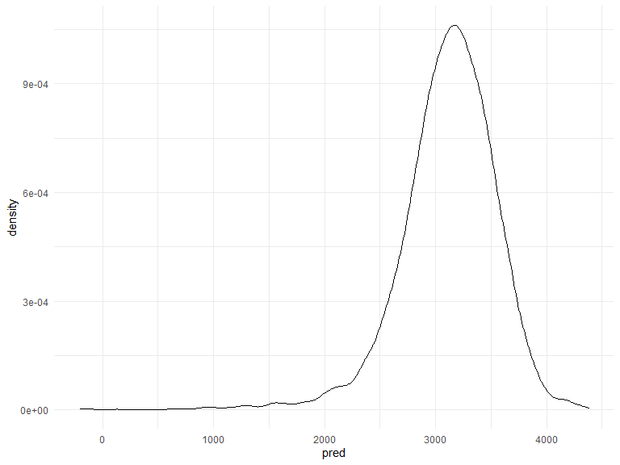

HW6
================
Soungbin Yim
2022-11-29

### Due date

Due: December 3 at 11:59pm.

### Points

| Problem   | Points |
|:----------|:-------|
| Problem 0 | 20     |
| Problem 1 | –      |
| Problem 2 | 40     |
| Problem 3 | 40     |

### Problem 0

This “problem” focuses on structure of your assignment, including the
use of R Markdown to write reproducible reports, the use of R Projects
to organize your work, the use of relative paths to load data, and the
naming structure for your files.

To that end:

- create a public GitHub repo + local R Project for this assignment
- write solutions using a .Rmd file that outputs a `github_document` /
  .md file
- submit a link to your repo via Courseworks

Your solutions to Problems 1 and 2 should be implemented in your .Rmd
file, and your git commit history should reflect the process you used to
solve these Problems.

For Problem 0, we will assess adherence to the instructions above
regarding repo structure, git commit history, and whether we are able to
knit your .Rmd to ensure that your work is reproducible. Adherence to
appropriate styling and clarity of code will be assessed in Problems 1+
using the homework [style rubric](homework_style_rubric.html).

This homework includes figures; the readability of your embedded plots
(e.g. font sizes, axis labels, titles) will be assessed in Problems 1+.

## Problem 1

## Problem 2

The Washington Post has gathered data on homicides in 50 large U.S.
cities and made the data available through a GitHub repository here. You
can read their accompanying article here.

Create a city_state variable (e.g. “Baltimore, MD”), and a binary
variable indicating whether the homicide is solved. Omit cities Dallas,
TX; Phoenix, AZ; and Kansas City, MO – these don’t report victim race.
Also omit Tulsa, AL – this is a data entry mistake. For this problem,
limit your analysis those for whom victim_race is white or black. Be
sure that victim_age is numeric.

``` r
homicide_df =
  read_csv("./homicide-data.csv") %>%
  mutate(
    victim_age = recode(victim_age,"Unknown" = ""),
    victim_age = as.numeric(victim_age),
    victim_race = fct_relevel(victim_race, "White"),
    city_state = str_c(city, ", ", state), 
    resolved = as.numeric(disposition == "Closed by arrest"),
  ) %>%
  filter(!(city_state %in% c("Dallas, TX", "Phoenix, AZ", "Kansas City, MO", "Tulsa, AL")) &
         victim_race %in% c("White", "Black")
  )
```

    ## Rows: 52179 Columns: 12
    ## ── Column specification ────────────────────────────────────────────────────────
    ## Delimiter: ","
    ## chr (9): uid, victim_last, victim_first, victim_race, victim_age, victim_sex...
    ## dbl (3): reported_date, lat, lon
    ## 
    ## ℹ Use `spec()` to retrieve the full column specification for this data.
    ## ℹ Specify the column types or set `show_col_types = FALSE` to quiet this message.

For the city of Baltimore, MD, use the glm function to fit a logistic
regression with resolved vs unresolved as the outcome and victim age,
sex and race as predictors. Save the output of glm as an R object; apply
the broom::tidy to this object; and obtain the estimate and confidence
interval of the adjusted odds ratio for solving homicides comparing male
victims to female victims keeping all other variables fixed.

``` r
baltimore_df = 
  homicide_df %>% 
  filter(city == "Baltimore") %>% 
  select(resolved, victim_age, victim_race, victim_sex)
```

``` r
fit_logistic = 
  baltimore_df %>% 
  glm(resolved ~ victim_age + victim_race + victim_sex, data = ., family = binomial()) 

fit_logistic %>% 
  broom::tidy() %>% 
  mutate(OR = exp(estimate),
         LCL = exp(estimate - 1.96*std.error),
         UCL = exp(estimate + 1.96*std.error)) %>%
  select(term, log_OR = estimate, OR, LCL, UCL) %>% 
  knitr::kable(digits = 3)
```

| term             | log_OR |    OR |   LCL |   UCL |
|:-----------------|-------:|------:|------:|------:|
| (Intercept)      |  1.152 | 3.164 | 1.989 | 5.031 |
| victim_age       | -0.007 | 0.993 | 0.987 | 1.000 |
| victim_raceBlack | -0.842 | 0.431 | 0.306 | 0.607 |
| victim_sexMale   | -0.854 | 0.426 | 0.325 | 0.558 |

Based on the table, the estimated odds ratio of having homicide solved
between male and female victims is 0.426, adjusting for victim age and
race, in Baltimore, MD. We are 95% confident that the true odds ratio of
having homicide solved between male and female victims lies between
0.325 and 0.558, adjusting for victim age and race, in Baltimore, MD.

Now run glm for each of the cities in your dataset, and extract the
adjusted odds ratio (and CI) for solving homicides comparing male
victims to female victims. Do this within a “tidy” pipeline, making use
of purrr::map, list columns, and unnest as necessary to create a
dataframe with estimated ORs and CIs for each city.

``` r
city_glm = 
  homicide_df %>%
  nest(data = -city_state) %>%
  mutate(
    models = map(data, ~glm(resolved ~ victim_age + victim_sex + victim_race, data = ., family = binomial())),
    results = map(models, broom::tidy)
    ) %>%
  select(city_state, models, results) %>%
  unnest(cols = results) %>%
  filter(term == "victim_sexMale") %>%
  mutate(
    OR = exp(estimate),
    LCL = exp(estimate - 1.96*std.error),
    UCL = exp(estimate + 1.96*std.error)
  ) %>%
   select(city_state, OR, LCL, UCL)
```

Create a plot that shows the estimated ORs and CIs for each city.
Organize cities according to estimated OR, and comment on the plot.

``` r
city_glm %>% 
  ggplot(aes(reorder(city_state, OR), OR)) + 
  geom_point(aes(color = city_state)) + 
  geom_errorbar(aes(ymin = LCL, ymax = UCL)) +
   labs(
    title = "Problem 2, plot of Adjusted OR and CI for solving homicides comparing male victims to female victims In each city ",
    x = "City, State",
    y = "Adjusted OR") +
   theme(axis.text.x = element_text(angle = 90),
         legend.position = "none")
```


Based on the plot, we can see the majority of adjusted ORs have their
values and upper CI below 1, meaning most of cities’ male victims have
smaller odds of solved homicide case than females. Many of ORs in the
plot do not contain the null value of 1, meaning they are not
significant.

## Problem 3

Loading and cleaning the data for the analysis, checking if there is any
missing data

``` r
birth_wt <- read.csv("./birthweight.csv") %>% 
  mutate(babysex = as.factor(babysex),
         frace = as.factor(frace),
         mrace = as.factor(mrace),
         malform = as.factor(malform),
         id = row_number())

str(birth_wt)
```

    ## 'data.frame':    4342 obs. of  21 variables:
    ##  $ babysex : Factor w/ 2 levels "1","2": 2 1 2 1 2 1 2 2 1 1 ...
    ##  $ bhead   : int  34 34 36 34 34 33 33 33 36 33 ...
    ##  $ blength : int  51 48 50 52 52 52 46 49 52 50 ...
    ##  $ bwt     : int  3629 3062 3345 3062 3374 3374 2523 2778 3515 3459 ...
    ##  $ delwt   : int  177 156 148 157 156 129 126 140 146 169 ...
    ##  $ fincome : int  35 65 85 55 5 55 96 5 85 75 ...
    ##  $ frace   : Factor w/ 5 levels "1","2","3","4",..: 1 2 1 1 1 1 2 1 1 2 ...
    ##  $ gaweeks : num  39.9 25.9 39.9 40 41.6 ...
    ##  $ malform : Factor w/ 2 levels "0","1": 1 1 1 1 1 1 1 1 1 1 ...
    ##  $ menarche: int  13 14 12 14 13 12 14 12 11 12 ...
    ##  $ mheight : int  63 65 64 64 66 66 72 62 61 64 ...
    ##  $ momage  : int  36 25 29 18 20 23 29 19 13 19 ...
    ##  $ mrace   : Factor w/ 4 levels "1","2","3","4": 1 2 1 1 1 1 2 1 1 2 ...
    ##  $ parity  : int  3 0 0 0 0 0 0 0 0 0 ...
    ##  $ pnumlbw : int  0 0 0 0 0 0 0 0 0 0 ...
    ##  $ pnumsga : int  0 0 0 0 0 0 0 0 0 0 ...
    ##  $ ppbmi   : num  26.3 21.3 23.6 21.8 21 ...
    ##  $ ppwt    : int  148 128 137 127 130 115 105 119 105 145 ...
    ##  $ smoken  : num  0 0 1 10 1 0 0 0 0 4 ...
    ##  $ wtgain  : int  29 28 11 30 26 14 21 21 41 24 ...
    ##  $ id      : int  1 2 3 4 5 6 7 8 9 10 ...

``` r
sapply(birth_wt, function(x) sum(is.na(x)))
```

    ##  babysex    bhead  blength      bwt    delwt  fincome    frace  gaweeks 
    ##        0        0        0        0        0        0        0        0 
    ##  malform menarche  mheight   momage    mrace   parity  pnumlbw  pnumsga 
    ##        0        0        0        0        0        0        0        0 
    ##    ppbmi     ppwt   smoken   wtgain       id 
    ##        0        0        0        0        0

`babysex`, `frace`, `mrace` were converted to factor variables, and
there was no missing values in the dataframe.

Propose a regression model for birthweight. This model may be based on a
hypothesized structure for the factors that underly birthweight, on a
data-driven model-building process, or a combination of the two.
Describe your modeling process and show a plot of model residuals
against fitted values – use add_predictions and add_residuals in making
this plot.

``` r
birth_wt %>% 
  ggplot(aes(x = bwt)) + 
  geom_histogram(binwidth = 25) + 
  labs(
    title = "Checking Assumption", x = "Birthweight (g)",y = "Count"
  )
```


Looking at the histogram, ‘birth_wt’ has relatively normal distribution.

I decided to exclude ‘pnumlbw’ and ‘pnumgsa’ ‘malform’ and ‘parity’
because they all have no observation or almost no observation, and
‘ppbmi’ because I decided to use ‘ppwt’ instead.

#### Building the full model

``` r
full_model = 
  lm(
    bwt ~ babysex + bhead + blength + delwt+ fincome+frace + gaweeks + menarche+ mheight + momage + mrace + smoken + ppwt + wtgain,
    data = birth_wt
  )
```

#### Summary table to see which covariates have p\<0.05 to come up with reduced model

``` r
summary(full_model) %>% 
  broom::tidy() %>% 
  select(term, estimate, p.value) %>% 
   mutate(
    p_value = format.pval(p.value, digits = 3, eps = 0.05)
  ) %>% 
  select(-p.value) %>%
  arrange(p_value) %>% 
  knitr::kable()
```

| term        |      estimate | p_value |
|:------------|--------------:|:--------|
| (Intercept) | -6068.4938166 | \<0.05  |
| babysex2    |    29.2645106 | \<0.05  |
| bhead       |   130.9601419 | \<0.05  |
| blength     |    74.8904878 | \<0.05  |
| delwt       |     4.1290227 | \<0.05  |
| gaweeks     |    11.2616326 | \<0.05  |
| mheight     |     6.7694335 | \<0.05  |
| mrace2      |  -151.4204451 | \<0.05  |
| smoken      |    -4.8595918 | \<0.05  |
| ppwt        |    -2.7526850 | \<0.05  |
| fincome     |     0.2752995 | 0.125   |
| mrace3      |   -92.7619838 | 0.197   |
| mrace4      |   -56.8242317 | 0.208   |
| menarche    |    -3.5277645 | 0.223   |
| frace4      |   -47.4657670 | 0.288   |
| momage      |     0.9797015 | 0.422   |
| frace2      |    14.4417524 | 0.754   |
| frace3      |    20.4717867 | 0.768   |
| frace8      |     4.3848564 | 0.953   |

The significant variables based on the table were ‘babysex2’, ‘bhead’,
‘blength’, ‘delwt’, ‘gaweeks’, ‘mheight’, ‘mrace2’, ‘smoken’, and
‘ppwt’.

#### reduced model

``` r
reduced_model = 
  lm(
    bwt ~ babysex + bhead + blength + delwt+ gaweeks +  mheight + mrace + smoken + ppwt,
    data = birth_wt
  )
birth_wt %>% 
  add_predictions(reduced_model) %>% 
  add_residuals(reduced_model) %>% 
  ggplot(aes(x = pred, y = resid)) + 
  geom_point() +
  labs(
    title = "Residuals against Fitted Values",
    x = "Fitted Values",
    y = "Residuals"
  )
```



Based on the plot created, the homoscedasticity assumptions seems to be
violated. Also, the there are some notable outliers. To resolve these
issues, few things can be done. We can include creating a formal rule
for the exclusion of outliers, or fitting a model that is robust to
outliers.

Compare your model to two others:

1)  One using length at birth and gestational age as predictors (main
    effects only)

2)  One using head circumference, length, sex, and all interactions
    (including the three-way interaction) between these

Make this comparison in terms of the cross-validated prediction error;
use crossv_mc and functions in purrr as appropriate.

Note that although we expect your model to be reasonable, model building
itself is not a main idea of the course and we don’t necessarily expect
your model to be “optimal”.

``` r
 crossv_mc(birth_wt, 100) %>% 
  mutate(
    train = map(train, as_tibble),
    test = map(test, as_tibble),
    current_mod = map(train, ~gam(bwt ~ s(wtgain) + s(delwt), data = .x)),
    other_mod_1  = map(train, ~lm(bwt ~ blength + gaweeks, data = .x)),
    other_mod_2  = map(train, ~lm(bwt ~ bhead + blength + babysex + bhead*blength + bhead*babysex + bhead*blength*babysex, data = .x))) %>% 
  mutate(
    rmse_current = map2_dbl(current_mod, test, ~rmse(model = .x, data = .y)),
    rmse_mod_1 = map2_dbl(other_mod_1, test, ~rmse(model = .x, data = .y)),
    rmse_mod_2 = map2_dbl(other_mod_2, test, ~rmse(model = .x, data = .y))) %>% 
  select(starts_with("rmse")) %>% 
  pivot_longer(
    everything(),
    names_to = "model", 
    values_to = "rmse",
    names_prefix = "rmse_") %>% 
  mutate(model = fct_inorder(model)) %>% 
  ggplot(aes(x = model, y = rmse)) + geom_violin()
```


Based on the plots that I created above, the reduced model has the
lowest mean value of rmse, meaning it may be the best fitted model among
three models.
